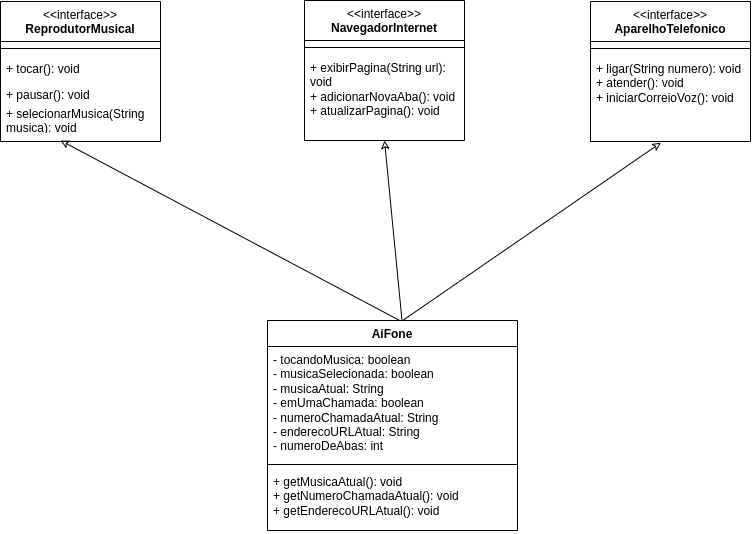

# Interfaces Dependentes da Classe Principal

A classe principal **AiFone** do projeto depende das seguintes interfaces:

## Interface ReprodutorMusical

### Descrição:
Esta interface representa um reprodutor musical. Tem as opções de selecionar música, tocar a música selecionada e pausar a música que estava tocando.

### Métodos:
- `tocar()`: Não tem parâmetro e não tem retorno.
- `pausar()`: Não tem parâmetro e não tem retorno.
- `selecionarMusica(String musica)`: Espera receber uma String e não tem retorno.

## Interface NavegadorInternet

### Descrição:
Esta interface representa um navegador para internet. Tem as opções de exibir a página web, adicionar nova aba e atualizar a página web.

### Métodos:
- `exibirPagina(String url)`: Espera receber uma String e não tem retorno.
- `adicionarNovaAba()`: Não tem parâmetro e não tem retorno.
- `atualizarPagina()`: Não tem parâmetro e não tem retorno.

## Interface AparelhoTelefonico

### Descrição:
Esta interface representa um aparelho telefônico. Tem as opções de fazer ligação, atender uma chamada e iniciar um correio de voz.

### Métodos:
- `ligar(String numero)`: Espera receber uma String e não tem retorno.
- `atender()`: Não tem parâmetro e não tem retorno.
- `iniciarCorreioVoz()`: Não tem parâmetro e não tem retorno.

## Gráfico UML
Para visualizar as dependências, veja o gráfico a seguir

